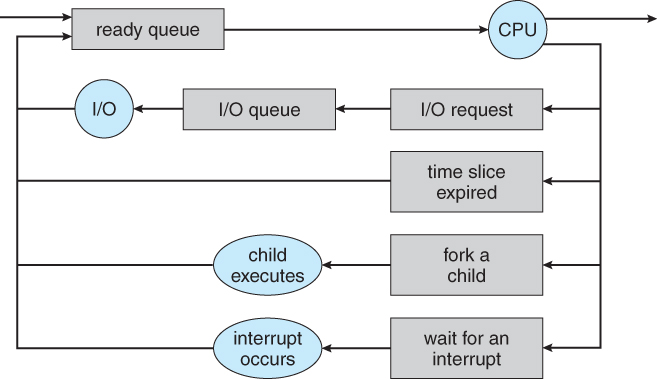

# Chapter 3. 프로세스

# 이 장의 목표

1. 프로세스의 개별 구성요소를 식별하고 운영체제에서 해당 구성요소가 어떻게 표현되고 스케줄 되는지 기술한다.
2. 운영체제에서 프로세스를 생성하고 종료하는 방법을 설명한다.
3. 공유 메모리 및 메시지 전달을 사용하는 프로세스 간 통신을 설명하고 대조한다.
4. 파이프와 POSIX 공유 메모리를 사용하여 프로세스 간 통신을 수행하는 프로그램을 설계한다.
5. 소켓과 원격 프로세저 호출을 사용하여 클라이언트-서버 통신을 설명한다.
~~6. Linux 운영체제와 상호 작용하는 커널 모듈을 설계한다.~~

## 1. 프로세스의 개별 구성요소를 식별하고 운영체제에서 해당 구성요소가 어떻게 표현되고 스케줄 되는지 기술한다.

프로세스의 현재 활동 상태는 프로그램 카운터 값과 프로세서 레지스터의 내용으로 나타낸다.
메모리 배치는 다음과 같다.
```
- - - - -  최대
-  스택
- - - - -
-
-
- - - - -
-   힙
- - - - -
- 데이터
- - - - -
- 텍스트
- - - - - 0
```
- __텍스트 섹션__: 실행 코드
- __데이터 섹션__: 전역 변수
- __힙 섹션__: 프로그램 실행 중에 동적으로 할당되는 메모리
- __스택 섹션__: 함수를 호출할 때 임시 데이터 저장장소(예: ㅎ함수 매개변수, 복귀 주소 및 지역 변수)

### Process Control Block

각 프로세스는 운영체제에서 프로세스 제어 블록(process control block, PCB)에 의해 표현된다. PCB는 특정 프로세스와 연관된 아래와 같은 정보를 제공한다.

- __프로세스 상태__: new, ready, running, waiting, halted
- __프로그램 카운터__: 이 프로세스가 다음에 실행할 명령어의 주소를 가리킨다.
- __CPU 레지스터들__: CPU 레지스터는 누산기(accumulator), 인덱스 레지스터, 스택 레지스터, 범용 레지스터들과 상태 코드 정보가 포함된다.
- __CPU-스케줄링 정보__: 프로세스 우선순위, 스케줄 큐에 대한 포인터와 다른 스케줄 매개변수를 포함한다.
- __메모리 관리 정보__: base register, limit register의 값, 페이지 테이블 또는 세그먼트 테이블과 같은 정보를 제공한다.
- __회계(accounting) 정보__: CPU 사용 시간과 경과된 실시간, 시간 제한, 계정 정보, 잡 또는 프로세스 번호
- __입출력 상태 정보__: 이 프로세스에 할당된 입출력 장치들과 열린 파일의 목록

### Process Scheduling

다중 프로그래밍 및 시간 공유의 목표를 균형 있게 유지하려면 프로세스의 일반적인 동작을 고려해야 한다. 일반적으로 대부분의 프로세스는 I/O 바운드 또는 CPU 바운드로 설명할 수 있다.

#### Scheduling Queue

프로세스가 시스템에 들어가면 준비 큐에 들어가서 준비 상태가 되어 CPU 코어에서 실행되기를 기다린다.

새 프로세스는 처음에 준비 큐에 놓인다.

<center><a href="images/3_06_QueueingDiagram.jpg"></a></center>

프로세스는 실행을 위해 선택되거나 또는 `디스패치` 될 때까지 기다린다. 프로세스에 CPU 코어가 할당되고 실행 상태가 되면, 여러 이벤트 중 하나가 발생할 수 있다.

- 프로세스가 I/O 요청을 공표한 다음 I/O 대기 큐에 놓일 수 있다.
- 프로세스는 새 자식 프로세스를 만든 다음 자식의 종료를 기다리는 동안 대기 큐에 놓일 수 있다.
- 인터럽트 또는 타임 슬라이스가 만료되어 프로세스가 코어에서 강제로 제거되어 준비 큐로 돌아갈 수 있다.

#### Context Switch

CPU 코어를 다른 프로세스로 교환하려면 이전의 프로세스의 상태를 보관하고 새로운 프로세스의 보관된 상태를 복구하는 작업이 필요하다. 이 작업은 `문맥 교환(context switch)`이라고 하고, 아래 그림에 묘사된다.

문맥 교환이 일어나면, 커널은 과거 프로세스의 문맥을 PCB에 저장하고, 실행이 스케줄된 새로운 프로세스의 저장된 문맥을 복구한다. 문맥 교환이 진행될 동안 시스템이 아무런 유용한 일을 못하기 때문에 문맥 교환 시간은 순수한 오버헤드이다.

<center><a href="images/3_04_ProcessSwitch.jpg"></a></center>

## 2. 운영체제에서 프로세스를 생성하고 종료하는 방법을 설명한다.

### 프로세스 생성

프로세스가 새로운 프로세스를 생성할 때, 두 프로세스를 실행시키는 데 두 가지 가능한 방법이 존재한다.

1. 부모는 자식과 병행하게 실행을 계속한다.
2. 부모는 일부 또는 모든 자식이 실행을 종료할 때까지 기다린다.

새로운 프로세스들의 주소 공간 측면에서 볼 때 다음과 같은 두 가지 가능성이 있다.

1. 자식 프로세스는 부모 프로세스의 복사본이다. (부모와 똑같은 프로그램과 데이터)
2. 자식 프로세스가 자신에게 적재될 새로운 프로그램을 가지고 있다.

UNIX 운영체제에서의 자세한 예를 들어서 보자.
새로운 프로세스는 `fork()` 시스템 콜로 생성되며, 새로운 프로세스는 부모 프로세스의 주소 공간 복사본으로 구성된다. 
다른 점은 부모 프로세스에서의 fork 리턴 코드는 자식 프로세스의 식별자인 반면, 자식 프로세스는 '0'을 반환 받는다.

여기서 자식 프로세스가 새로운 프로그램을 수행하고자 하면, `exec()` 시스템을 콜을 사용하여 자신의 메모리 공간을 새로운 프로그램으로 교체한다.
exec() 시스템 콜은 이진 파일을 메모리로 적재하고(원래 프로그램의 메모리 이미지를 파괴) 그 프로그램의 실행을 시작한다.

### 프로세스 종료

프로세스가 마지막 문장의 실행을 끝내고, exit 시스템 콜을 사용하여 운영체제에 자신의 삭제를 요청하면 종료한다. 이 시점에서, 프로세스는 자신을 기다리고 있는 부모 프로세스에(wait 시스템 콜을 통해) 상태 값(통상 정수값)을 반환할 수 있다. 물리 메모리와 가상 메모리, 열린 파일, 입출력 버퍼를 포함한 프로세스의 모든 자원이 할당 해제되고 운영체제로 반납된다.

프로세스를 종료하는 다른 경우로서, 부모가 자식 중 하나의 실행을 종료할 수 있다.

- 자식이 자신에게 할당된 자원을 초과하여 사용할 때, 이때는 부모가 자식들의 상태를 검사할 수 있는 방편이 주어져야 한다.
- 자식에게 할당된 태스크가 더 이상 필요 없을 때
- 부모가 exit를 하는데, 운영체제는 부모가 exit 한 후에 자식이 실행을 계속하는 것을 허용하지 않을 경우

#### zombie, orphan

프로세스가 종료되면 사용하던 자원은 운영체제가 되찾아 간다.
그러나 커널에서 관리하는 테이블에 프로세스 정보는 남아 있게 된다. 종료되었지만 부모 프로세스가 wait() 호출을 하지 않은 프로세스를 zombie process 라 한다.

반대로 부모 프로세스가 wait를 하지 않고 먼저 종료되면, 자식 프로세스를 orphan process 라 한다. 전통적인 UNIX는 고아 프로세스의 새로운 부모 프로세스로 init 프로세스를 지정함으로써 이 문제를 해결한다.

## 3. 공유 메모리 및 메시지 전달을 사용하는 프로세스 간 통신을 설명하고 대조한다.

협력적 프로세스들은 데이터를 교환할 수 있는, 즉 서로 데이터를 보내거나 받을 수 있는 프로세스 간 통신(interprocess communiccation, `IPC`) 기법이 필요하다.

프로세스 간 통신에는 기본적으로 `공유 메모리`(shared memory)와 `메시지 전달`(message passing)의 두 가지 모델이 있다.

### IPC in Shared-Memory Systems

공유 메모리를 사용하기 위해 세그먼트를 생성하는 프로세스 주소 공간에 위치한다. 이 공유 메모리 세그먼트를 통해 통신하고ㅗ자 하는 다른 프로세스들은 이 세그먼트를 자신의 주소 공간에 추가하여야 한다.

공유 메모미를 사용하는 일반적인 패러다임인 생산자-소비자 문제로 생각해보자. 
말 그대로 생산자가 데이터를 생산(write)하고 소비자가 데이터를 소비(read)한다.
공유하고자 하는 데이터가 있을 버퍼가 필요한데 이것 또한 2가지 유형으로 나눠서 볼 수 있다.

- 무한 버퍼(unbounded buffer): 버퍼가 비어 있으면 소비자는 대기해야 하지만, 생산자는 항상 새로운 항목을 생산할 수 있다.

- 유한 버퍼(bounded buffer): 버퍼가 비어 있으면 소비자는 반드시 대기해야 하며, 모든 버퍼가 채워져 있으면 생산자는 대기한다.

메모리에 바로 접근하므로 성능은 상대적으로 빠르나, 공유 자원에 대한 동기화 등의 문제를 사용자가 직접 고려하여 구현해야 하는 어려움이 있다.

### IPC in Message-Passing Systems

여러가지 기법 중 메일 박스 형태를 이용한 간접 통신 방법을 살펴볼 것이다.
메일 박스는 추상적으로 프로세스들에 의해 메시지들이 넣어지고, 메시지들이 제거될 수 있는 객체라고도 볼 수 있다.
각 메일 박스는 고유의 id를 가진다. 예를 들어 POSIX 메시지 큐는 메일박스를 식별하기 위해 정수 값을 사용한다.

프리미티브는 다음과 같이 정의할 수 있다.
- __send(A, message)__: 메시지를 메일박스 A로 송신한다.
- __receive(A, message)__: 메시지를 메일박스 A로부터 수신한다.

이 방법에서의 통신 연결은 다음과 같은 특성을 가진다.

- 한 쌍의 프로세스들 사이의 연결은 이들 프로세스가 공유 메일박스를 가질 때만 구축된다.
- 연결은 두 개 이상의 프로세스들과 연관될 수 있다.
- 통신하고 있는 각 프로세스 사이에는 다수의 서로 다른 연결이 존재할 수 있고, 각 연결은 하나의 메일박스에 대응된다.

버퍼 사용에 대해서 공유 메모리와 같은 무한, 유한에 덧붙여 zero capacity 방식이 존재할 수 있다.

- zero capacity: 송신자는 수신자가 메시지를 수신할 때까지 기다려야 한다.
- bounded capacity: ...
- unbounded capacity: ...

## 4. 파이프와 POSIX 공유 메모리를 사용하여 프로세스 간 통신을 수행하는 프로그램을 설계한다.

### 파이프

#### Ordinary Pipes

일반 파이프는 생산자-소비자 형태로 두 프로세스간 통신을 허용한다.

UNIX 시스템에서 일반 파이프는 다음 함수를 사용하여 구축된다.
fd[0]은 파이프의 읽기 종단이고, fd[1]은 파이프의 쓰기 종단으로 동작한다.
```c
pipe(int fd[])
```

일반 파이프는 파이를 생성한 프로세스 이외에는 접근할 수 없으므로 부모 프로세스가 파이프를 생성하고 fork()로 생성한 자식 프로세스와 통신하기 위해 사용한다. 자식 프로세스는 부모 프로세스로부터 파이프를 상속 받는다.

#### Named Pipes

통신은 양방향으로 가능하며 부모 - 자식 관계도 필요로 하지 않는다. 여러 프로세스들이 사용하여 다수의 writer를 가질 수도 있다. 추가로 통신 프로세스가 종료되더라도 지명 파이프는 계속 존재한다.

지명 파이프를 UNIX에서는 FIFO라고 부르며, 파일 시스템의 보통 파일처럼 존재한다.

`mkinfo()` 시스템 콜을 이용하여 생성되고 일반적인 open(), read(), write(), close 시스템 콜로 조작된다.

### POSIX 공유 메모리

```c
/* 공유 메모리 객체 생성 */
fd = shm_open(name, O_CREATE | O_RDWR, 0666);

/* 객체 크기를 바이트 단위로 지정 */
ftruncate(fd, 4096);

/* 공유 메모리 객체에 매핑된 포인터 값 */
ptr = (char *)
  mmap(0, SIZE, PROT_READ | PROT_WRITE, MAP_SHARED, fd, 0);

/* 공유 메모리 객체에 메세지를 출력 */
sprintf(ptr, "%s",message_0);

/* 추가 정보 입력하기 위해서는 포인터를 기존 입력 크기만큼 옮겨줘야됨 */
ptr += strlen(message_0)

...

```

## 5. 소켓과 원격 프로시저 호출을 사용하여 클라이언트-서버 통신을 설명한다.

### Socket

소켓은 통신의 endpoint를 뜻한다.

일반적으로 소켓은 클라이언트-서버 구조를 사용한다.

서버는 지정된 포트에 클라이언트 요청 메시지가 도착하기를 기다리게 된다. 요청이 수신되면 서버는 클라이언트 소켓으로부터 연결 요청을 수락함으로써 연결이 완성된다.

클라이언트 프로세스가 연결을 요청하면 호스트 컴퓨터가 포트 번호를 부여한다. 이 번호는 1024보다 큰 임의 정수가 된다. (<65535)

연결은 이 두 개의 소켓 (host:port)으로 구성된다. 모든 연결은 유일한 소켓 쌍으로 구성된다. 이후 바이트 스트림 데이터를 통신한다.

### RPC _Remote Procedure Call

네트워크에 연결된 두 시스템 사이의 통신에 사용하기 위해 프로시저 호출 기법을 추상화하는 방법으로 설계되었다.

RPC 각 메시지에는 원격 포트에서 listen 중인 RPC daemon 주소가 지정되어 있고 실행되어야 할 함수의 식별자, 그리고 그 함수에게 전달되어야할 매개변수가 포함된다.

RPC는 클라이언트가 원격 호스트의 프로시저 호출하는 것을 마치 자기의 프로시저 호출하는 것처럼 해준다. 
RPC 시스템은 클라이언트 쪽에 `스텁`을 제공하여 통신을 하는 데 필요한 자세한 사항들은 숨겨준다. 그러면 스텁이 원격 서버의 포트를 찾고 매개변수를 정돈(`marshall`)한다.
그 후 스텁은 메시지 전달 기법을 사용하여 서버에게 메시지를 전송한다.

그리고 네트워크를 통한 메시지 전달이기에 `정확히 한번` 처리되도록 보장하기 위한 방법이 필요하다.
- 최대 한번 실행: 모든 메시지에 타임스탬프와 같은 값을 포함하여 중복 처리가 가능하도록 한다.
- 정확히 한번: RPC 요청이 수신된 뒤 실행되었다는 acknowledgement(ACK) 메시지를 받을 때까지 재전송
